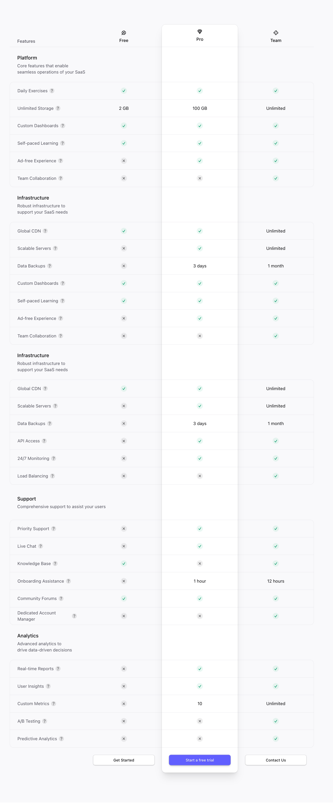

# Comparator

Highly customizable column-based comparator component.

## Demos



## Installation

```Shell
npm add sv0 display/comparator
```

## Usage

Example usage of this component:

### Template (Declarative, Markup-Driven) Example

```HTML
<script lang="ts">
  import { Comparator } from "sv0/display/comparator";
</script>

<Comparator.Root>
  <Comparator.Section>
    <Comparator.Header>
      <Comparator.Cell>Group 1</Comparator.Cell>
      <Comparator.Cell>?</Comparator.Cell>
      <Comparator.Cell>?</Comparator.Cell>
      <Comparator.Cell>?</Comparator.Cell>
    </Comparator.Header>
    <Comparator.Row>
      <Comparator.Cell>Feature 1</Comparator.Cell>
      <Comparator.Cell>Yes</Comparator.Cell>
      <Comparator.Cell>Yes</Comparator.Cell>
      <Comparator.Cell>Yes</Comparator.Cell>
    </Comparator.Row>
    <Comparator.Row>
      <Comparator.Cell>Feature 2</Comparator.Cell>
      <Comparator.Cell>No</Comparator.Cell>
      <Comparator.Cell>Yes</Comparator.Cell>
      <Comparator.Cell>Yes</Comparator.Cell>
    </Comparator.Row>
  </Comparator.Section>
  <Comparator.Section>
    <Comparator.Header>
      <Comparator.Cell>Group 2</Comparator.Cell>
      <Comparator.Cell>?</Comparator.Cell>
      <Comparator.Cell>?</Comparator.Cell>
      <Comparator.Cell>?</Comparator.Cell>
    </Comparator.Header>
    <Comparator.Row>
      <Comparator.Cell>Feature 3</Comparator.Cell>
      <Comparator.Cell>No</Comparator.Cell>
      <Comparator.Cell>Yes</Comparator.Cell>
      <Comparator.Cell>Yes</Comparator.Cell>
    </Comparator.Row>
    <Comparator.Row>
      <Comparator.Cell>Feature 4</Comparator.Cell>
      <Comparator.Cell>No</Comparator.Cell>
      <Comparator.Cell>No</Comparator.Cell>
      <Comparator.Cell>Yes</Comparator.Cell>
    </Comparator.Row>
  </Comparator.Section>
</Comparator.Root>
```

## Declarative (Markup-Driven Atom Composition) Reference

This component is composed of these markup-driven atoms:

| Atom                                       | Description                             | Required |
| ------------------------------------------ | --------------------------------------- | :------: |
| [`Comparator.Root`](#comparatorroot)       | Primary container to maintain children. |   Yes    |
| [`Comparator.Section`](#comparatorsection) | Grouping of rows.                       |   Yes    |
| [`Comparator.Header`](#comparatorheader)   | Header of a section.                    |          |
| [`Comparator.Row`](#comparatorrow)         | Individual row of of cells.             |   Yes    |
| [`Comparator.Cell`](#comparatorcell)       | Individual cell (column).               |   Yes    |

### `Comparator.Root`

This atom is the root provider of comparator state.

| Prop    | Description             | Type                   | Default | Required |
| ------- | ----------------------- | ---------------------- | ------- | :------: |
| `class` | Additional class names. | `string \| string[]`   | `""`    |          |
| `size`  | Size of the comparator. | `"sm" \| "md" \| "lg"` | `"md"`  |          |

### `Comparator.Section`

This atom defines a section of the comparator.

| Prop    | Description             | Type                 | Default | Required |
| ------- | ----------------------- | -------------------- | ------- | :------: |
| `class` | Additional class names. | `string \| string[]` | `""`    |          |

### `Comparator.Header`

This atom defines the header of a section.

| Prop    | Description             | Type                 | Default | Required |
| ------- | ----------------------- | -------------------- | ------- | :------: |
| `class` | Additional class names. | `string \| string[]` | `""`    |          |

### `Comparator.Row`

This atom defines a row of cells.

| Prop    | Description             | Type                 | Default | Required |
| ------- | ----------------------- | -------------------- | ------- | :------: |
| `class` | Additional class names. | `string \| string[]` | `""`    |          |

### `Comparator.Cell`

This atom defines a cell of a row.

| Prop    | Description             | Type                 | Default | Required |
| ------- | ----------------------- | -------------------- | ------- | :------: |
| `class` | Additional class names. | `string \| string[]` | `""`    |          |
